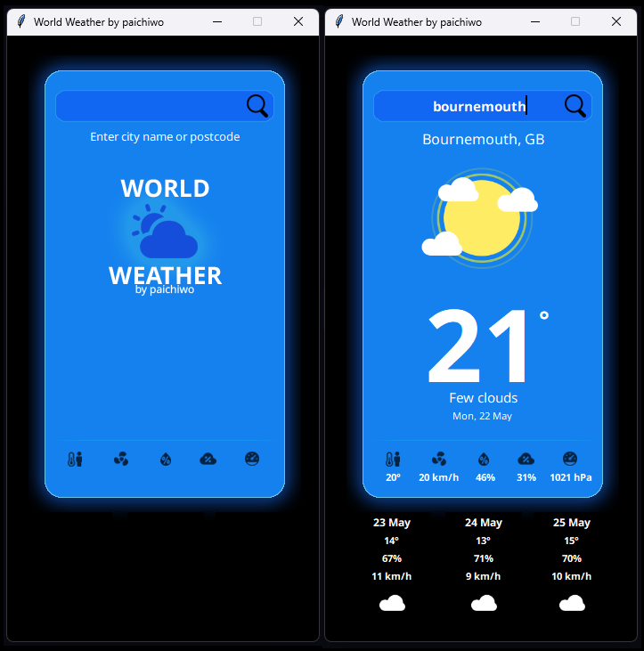

# **Weather App with PySimpleGUI**

This is a simple Python app that displays the current weather information for a given location, using the [PySimpleGUI](https://pysimplegui.readthedocs.io/en/latest/) library for the GUI and the [Weatherstack](https://weatherstack.com/) API for the weather data.

The app displays a window with three columns: an image column with an icon representing the current weather condition, and two info columns with details about the temperature, wind, humidity, etc. The user can input a location in a text field, and click a button to update the weather information.

## **Prerequisites**

To run this app, you need to have Python 3.x and PySimpleGUI installed. You also need to sign up for a free API key from [Weatherstack](https://weatherstack.com/) and paste it in the **api\_key** variable in the code.

You can install the required modules via pip:

`pip install pysimplegui`   
`pip install requests`

Alternatively run this command for automatic module installation:

`pip install -r requirements.txt`

## **How to Run**

To run the app, open a terminal in the folder containing the code file, and type:

`python World_Weather.py`

This should open the app window. You can enter a location (e.g., "London, UK") in the input field, and click the "Search" button to update the weather information.

## **How to Customize**

You can customize the app by changing the images in the **weather\_icons** dictionary to match your own icons, or by modifying the GUI layout in the **create\_window** function. You can also change the theme of the app by passing a different theme name to the **sg.theme** function in the **create\_window** function. The available theme names are listed in the [PySimpleGUI documentation](https://pysimplegui.readthedocs.io/en/latest/#themes).

## **Contributing**

Contributions are always welcome and appreciated! If you find any issues or have suggestions for improvements, please feel free to open an issue or pull request on the GitHub repository.

To contribute, please follow these steps:

1.  Fork the repository to your own GitHub account.
2.  Clone the repository to your local machine.
3.  Create a new branch for your changes.
4.  Make your changes and commit them with clear commit messages.
5.  Push your changes to your forked repository.
6.  Open a pull request to the main repository.

Please ensure that your code is well-documented, tested, and follows the existing code style and guidelines. By contributing, you agree to release your code under the same MIT license as the original code.

## **License**

This app is released under the [MIT License](https://opensource.org/licenses/MIT). Feel free to use, modify, and distribute it as you like.

## **Examples**

